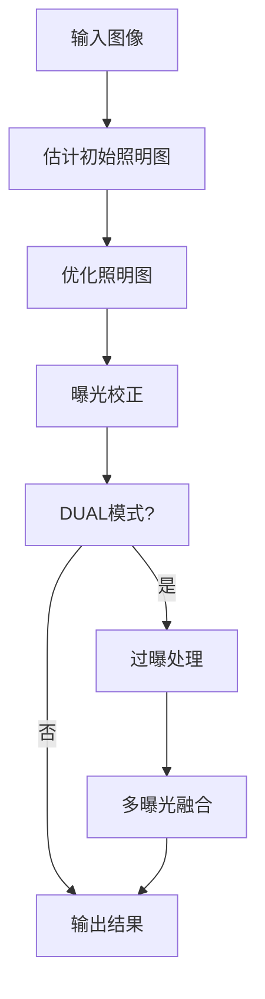

# 低光照图像增强算法技术报告

## 1. 算法概述

该实现结合了两种低光照增强方法：
- DUAL（Dual-exposure fusion）
- LIME（Low-light Image Enhancement）

核心思路是基于 Retinex 理论，将图像分解为照明图（Illumination Map）和反射图（Reflectance Map）。

## 2. 主要算法流程

### 2.1 基本流程


### 2.2 关键步骤详解

#### 2.2.1 照明图估计与优化

```python
# 初步估计照明图
L = np.max(im, axis=-1)

# 优化照明图
L_refined = refine_illumination_map_linear(L, gamma, lambda_, kernel, eps)
```

照明图优化采用变分方法，通过求解以下优化问题：

```
min_L ||L - L_input||² + λ * (Wx|∂xL|² + Wy|∂yL|²)
```

其中：
- L_input 是初始照明图
- Wx, Wy 是空间权重
- λ 是平衡参数

#### 2.2.2 空间权重计算

```python
def compute_smoothness_weights(L, x, kernel, eps=1e-3):
    # 计算x或y方向的梯度
    Lp = cv2.Sobel(L, cv2.CV_64F, int(x == 1), int(x == 0), ksize=1)
    
    # 计算空间亲和度
    T = convolve(np.ones_like(L), kernel, mode='constant')
    T = T / (np.abs(convolve(Lp, kernel, mode='constant')) + eps)
    
    return T / (np.abs(Lp) + eps)
```

权重计算考虑了：
1. 图像梯度信息
2. 空间距离衰减
3. 结构相似性

#### 2.2.3 DUAL模式的多曝光融合

当启用DUAL模式时，算法会：
1. 处理欠曝光
2. 处理过曝光
3. 使用Mertens融合方法合成最终结果

```python
def fuse_multi_exposure_images(im, under_ex, over_ex, bc=1, bs=1, be=1):
    merge_mertens = cv2.createMergeMertens(bc, bs, be)
    images = [np.clip(x * 255, 0, 255).astype("uint8") 
             for x in [im, under_ex, over_ex]]
    return merge_mertens.process(images)
```

## 3. 关键参数说明

### 3.1 gamma参数
- 控制照明图的非线性调整
- 范围：0.1-2.0
- 较小值使图像更亮，较大值使图像更暗
- 推荐值：0.6

### 3.2 lambda参数
- 控制照明图优化的平滑程度
- 范围：0.05-1.0
- 较小值保留更多细节但可能引入噪声
- 较大值平滑效果更好但可能丢失细节
- 推荐值：0.15

## 4. 性能优化

代码中包含了几个重要的性能优化措施：

```python
def enhance_image_exposure(im, gamma, lambda_, dual=True, sigma=3):
    # 1. 降采样处理大图像
    if max(height, width) > 1024:
        scale = 1024 / max(height, width)
        small_im = cv2.resize(im_normalized, None, fx=scale, fy=scale)
    
    # 2. 使用较小的kernel size
    kernel = create_spacial_affinity_kernel(sigma, size=7)
    
    # 3. 使用单精度浮点数
    im_normalized = im.astype(np.float32) / 255.
```

## 5. 优缺点分析

### 优点：
1. 支持两种增强模式（DUAL和LIME）
2. 考虑了空间一致性
3. 包含性能优化措施
4. 参数可调节性强

### 缺点：
1. 大图像处理耗时较长
2. 对于极端低光照场景效果可能不够理想
3. 参数调节需要经验

## 6. 应用场景

适用于：
- 室内低光照场景
- 逆光场景
- 阴影区域细节增强
- 夜景照片优化

不适用于：
- 极度噪声图像
- 需要实时处理的场景
- 艺术效果处理

这个实现综合了多种技术，既考虑了效果也注重了实用性，是一个比较完整的低光照增强解决方案。